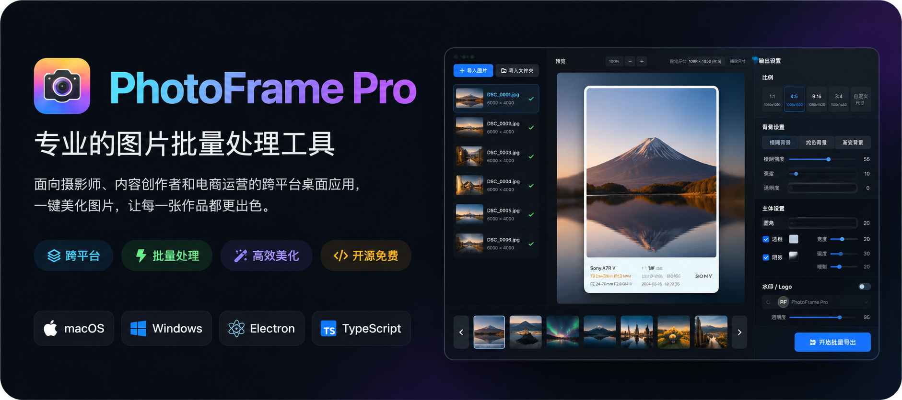

<p align="center">
  
</p>

<h1 align="center">PhotoFrame Pro</h1>

<p align="center">
  面向摄影师、内容创作者和电商运营的跨平台桌面图片批处理工具。
</p>

<p align="center">
  <strong>macOS / Windows</strong> · <strong>Electron</strong> · <strong>TypeScript</strong> · <strong>本地图片处理</strong>
</p>

PhotoFrame Pro 是一款面向摄影师、内容创作者和电商运营的桌面图片批处理工具。它可以把原图快速处理成统一比例的发布图：生成背景、居中主体、添加边框、叠加 Logo、显示 EXIF 信息，并批量导出成 JPG、PNG 或 WEBP。

## 功能

- 图片拖拽导入、文件选择导入、文件夹批量导入
- 1:1、4:5、9:16、3:4 和自定义输出尺寸
- 模糊背景、纯色背景、渐变背景
- 主体图片自动缩放居中，支持边框、圆角和阴影
- Logo 水印上传、位置、大小和透明度调整
- EXIF 信息读取、展示和手动覆盖
- 内置摄影白边、小红书模糊背景、商品白底、黑色高级感模板
- 自定义模板保存、导入、导出、删除
- 批量导出 JPG、PNG、WEBP，支持质量和命名规则设置

## 技术栈

- Electron
- React
- TypeScript
- Vite
- Zustand
- exifr
- Sharp

图片处理在本地完成，不需要上传到服务器。

## 开发

```bash
npm install
npm run electron:dev
```

只调试前端界面时可以使用：

```bash
npm run dev
```

## 构建

```bash
npm run build
```

生成桌面应用目录：

```bash
npm run package
```

## 使用流程

1. 导入单张图片或整个图片文件夹。
2. 选择输出比例或输入自定义尺寸。
3. 调整背景、主体边框、Logo 和 EXIF 设置。
4. 需要复用当前参数时保存为模板。
5. 选择输出目录、格式、质量和命名规则。
6. 点击「开始批量导出」。

## 验收范围

当前版本覆盖 MVP 所需的核心链路：

- 导入 20 张以上图片
- 选择 4:5 输出
- 生成模糊背景
- 显示和编辑 EXIF
- 添加 Logo
- 批量导出 JPG
- 导出尺寸与预览设置一致

## 许可证

暂未指定许可证。
